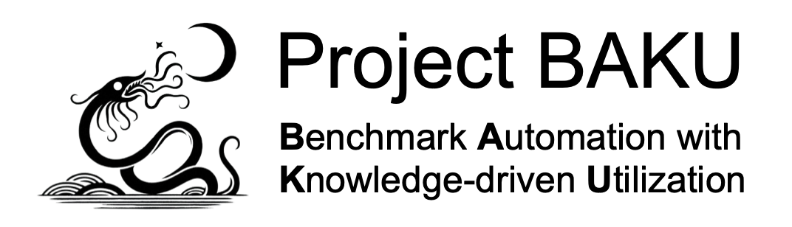

   

## Goals
The goal of this project is to train and fine-tune large language models to generate benchmarks to stress-test computing systems such as compilers, operating systems and memory allocation systems.
